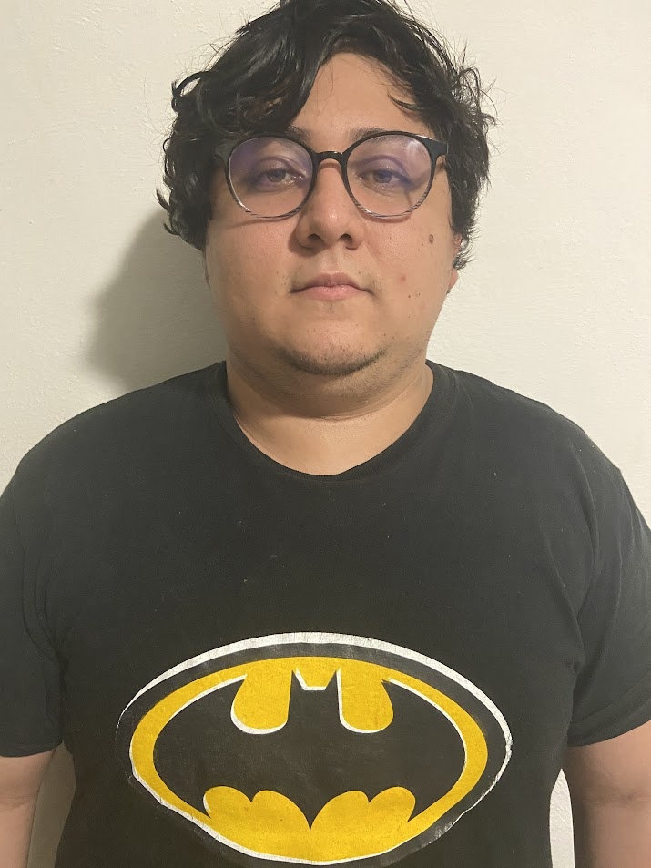

# Arquitectura-de-Software

Proyecto de la asignatura Arquitectura de Software (2024).

### Integrantes del equipo

| Nombre                         | Foto                                                 |
|--------------------------------|------------------------------------------------------|
| Marco Elias Aragón Serrano    |       |
| Alejandro Cauich Kú           |   |
| Carlos Ermilo Manzanero Canto |      |
| Jose Manuel Gómez Chan        |        |
